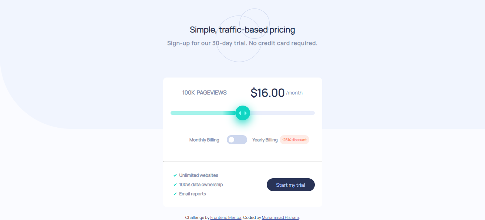

# Frontend Mentor - Interactive pricing component solution

This is a solution to the [Interactive pricing component challenge on Frontend Mentor](https://www.frontendmentor.io/challenges/interactive-pricing-component-t0m8PIyY8). Frontend Mentor challenges help you improve your coding skills by building realistic projects.

## Table of contents

- [Overview](#overview)
  - [The challenge](#the-challenge)
  - [Screenshot](#screenshot)
  - [Links](#links)
- [My process](#my-process)
  - [Built with](#built-with)
  - [What I learned](#what-i-learned)
  - [Useful resources](#useful-resources)
- [Author](#author)

## Overview

### The challenge

Users should be able to:

- View the optimal layout for the app depending on their device's screen size
- See hover states for all interactive elements on the page
- Use the slider and toggle to see prices for different page view numbers

### Screenshot

### Links

- Live Site URL: [https://interactive-pricing-component-coral-seven.vercel.app/](https://interactive-pricing-component-coral-seven.vercel.app/)

## My process

### Built with

- Semantic HTML5 markup
- CSS custom properties
- Flexbox
- CSS Grid
- Mobile-first workflow
- JavaScript

### What I learned

- how to customize input range with `HTML`and`CSS`.
- how to customize checkbox.
- how to interacte between two inputs `type="range"`and`type="checkbox"` using vanilla `Javascript`.

### Useful resources

- [https://css-tricks.com/styling-cross-browser-compatible-range-inputs-css/](https://css-tricks.com/styling-cross-browser-compatible-range-inputs-css/) - This helped me for styling cross browser compatible input range.
- [https://profile.w3schools.com/refresh-session?redirect_url=https%3A%2F%2Fwww.w3schools.com%2Fhowto%2Fhowto_js_rangeslider.asp](https://profile.w3schools.com/refresh-session?redirect_url=https%3A%2F%2Fwww.w3schools.com%2Fhowto%2Fhowto_js_rangeslider.asp) - This is an amazing reference which helped me create custom range sliders.

## Author

- Frontend Mentor - [@mohamedhesham221](https://www.frontendmentor.io/profile/mohamedhesham221)
- Linkedin - [Muhammad Hisham](https://www.linkedin.com/in/muhammad-hisham-23544b253/)
